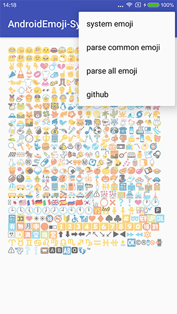
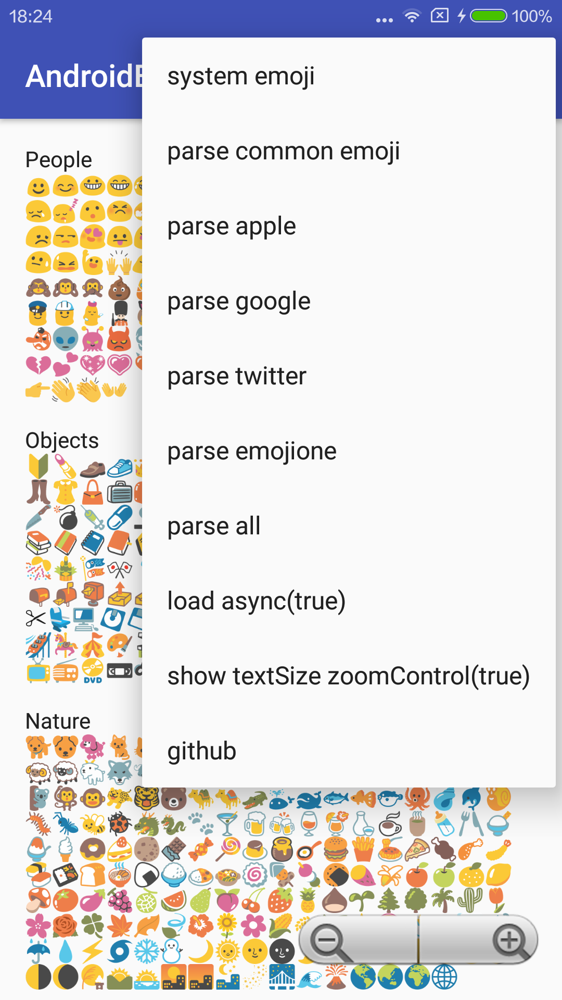

# AndroidEmoji

> j.s 🇨🇳

AndroidEmoji


# Features

* API > 9 
* Support load emoji from file  

## Screen Record




 
# XhsEmoticonsKeyboard

If you need a keyboard --> [XhsEmoticonsKeyboard](https://github.com/w446108264/XhsEmoticonsKeyboard) 

 
 
  
 
 
  
 
 

# Samples

You can [download a sample APK](https://github.com/w446108264/AndroidEmoji/raw/master/output/simple.apk) 
 
 
# Gradle Dependency

Users of your library will need add the jitpack.io repository:

```xml  
allprojects {
    repositories {
        jcenter()
        maven { url "https://jitpack.io" }
    }
}
```

and:

```xml
dependencies { 
    compile 'com.github.w446108264:AndroidEmoji:1.0.0'
}
```
--

### Simple

```java

        SpannableStringBuilder spannableStringBuilder = new SpannableStringBuilder(content); 
        Spannable spannable = EmojiDisplay.spannableFilter(tv_content.getContext(),
                spannableStringBuilder,
                content,
                getFontHeight(tv_content));
        tv_content.setText(spannable);

```
 
 
# Contact & Help

Please fell free to contact me if there is any problem when using the library.

* email: shengjun8486@gmail.com 


